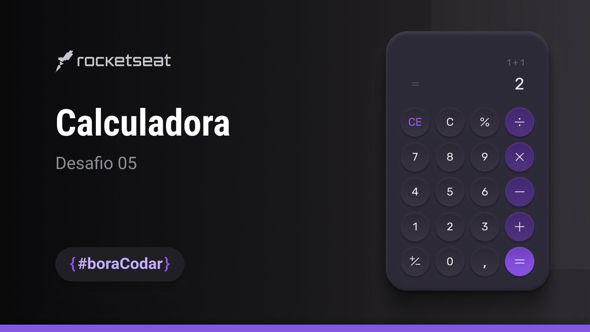

# 🧮 Calculadora Simples

Uma calculadora simples desenvolvida com **JavaScript**, **HTML** e **CSS**.

## 📌 Sobre o Projeto

Este projeto tem como objetivo praticar conceitos fundamentais de JavaScript como:
- Funções
- Eventos de clique
- Operações matemáticas básicas

## ⚙️ Funcionalidades

- Soma
- Subtração
- Multiplicação
- Divisão
- Limpar (`C`)
- Vírgula decimal

## 💻 Tecnologias Utilizadas

- HTML5
- CSS3
- JavaScript

## 🖼️ Interface

Esta interface foi feita pela escolha de programação [ROCKETSEAT](https://www.figma.com/@rocketseat), Esse desafio foi criado para o #boracodar, um projeto da Rocketseat com desafios semanais para você praticar desenvolvendo como achar melhor e evoluir seu código para o próximo nível.

## 🚀 Demonstração do projeto

https://calculadora-b-sica-zeta.vercel.app
